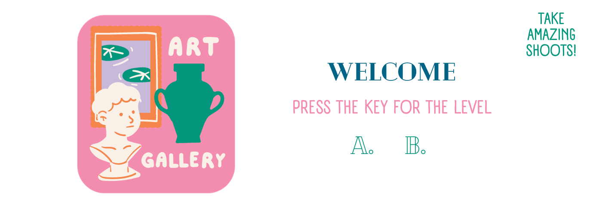

# Raycasting-CC2018
Proyecto 02, Gráficas por computadora. Raycast simple que renderiza un nivel de juego con temática de una galería de arte.

## Dependencias
- SDL
- SDL_image
- SDL_events
- SDL_render
- SDL_video

## Demostraciones
### Algunas imágenes del juego

### Video de ejecución
https://clipchamp.com/watch/SqjxcJg0ows

## Criterios utilizados
- (0 a 30 puntos) [Criterio subjetivo] Según la estética de su nivel
- (20 puntos) Por implementar una cámara con movimiento hacia delante y hacia atrás y rotación
- (10 puntos) Por implementar rotación con el mouse (solo horizontal)
- (5 puntos) Por agregar música de fondo.
- (10 puntos) Por agregar efectos de sonido
- (20 puntos) Por agregar al menos 1 animación a alguna sprite en la pantalla
- (5 puntos) Por agregar una pantalla de bienvenida 
- (10 puntos) Si la pantalla permite seleccionar entre multiples niveles 
- (10 puntos) Por agregar una pantalla de exito cuando se cumpla una condicion en el nivel